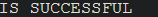

# Neural_Network_Charity_Analysis
## Overview
The purpose of the analysis was to determine which organizations Alphabet Soup should fund based on the data in the csv.
## Results
### Data Preprocessing
- These are the targets for our model.

.png)

- This is the feature for our model.

- These are the variables not used for the model.

### Compiling, Training, and Evaluating the Model
- I decided to go with 2 hidden layers, the first one I used 8 neurons and the second I used 5. I used the relu activation on the first hidden layer, and sigmoid on the second. I used the relu and sigmoid activation as I figured they would work well together with the data.
- I was unable to achieve the target performance.
- I took many steps to try to improve the performance, I started by testing my hidden layers, seeing if I needed to add some or some neurons. I ended up adding 1 hidden layer and 8 neurons in total. I also tried to bin the ASK_AMT column to reduce the drastic outliers but had trouble implementing it. Lastly I tried to drop columns I felt were not needed, this did not work as when I took certain columns away the performance was lower then before.

## Summary
This challenge was definetly a challenge, I really had to try on this assignment to do some of the task and still felt as though there was room to improve. That is a part of optimizing data for neural networks though is always making the performance better. This assignment we took a csv file from Alphabet Soup and found which organizations would be good to fund based on the data. I would not recommend using a neural network to analyze this data instead using the random forest seems like a better model to use as we have used it in the past, and it can weight certain values more or less depending on what we need.
